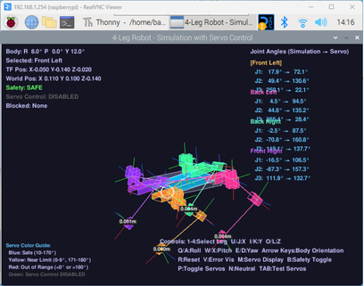
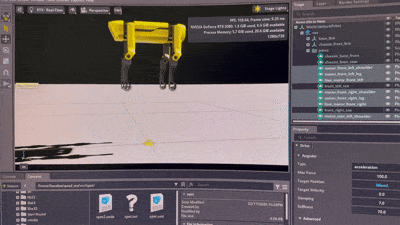
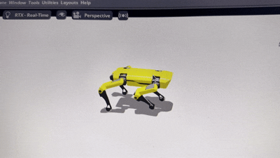
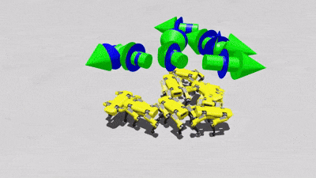
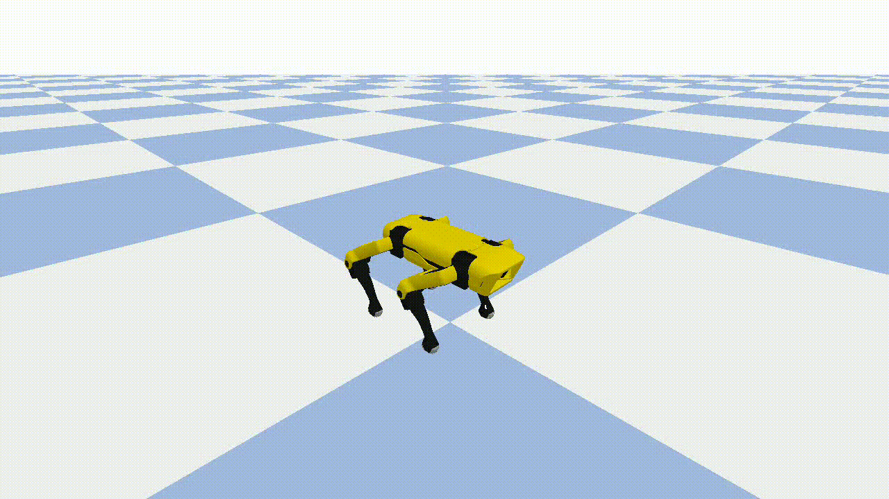

# Rex — Quadruped Locomotion in Isaac Lab (WIP)

<div align="center">
    
\
**A large-scale reinforcement learning framework for servo-actuated SpotMicro-class quadruped locomotion with systematic sim-to-sim validation**

[](https://isaac-sim.github.io/IsaacLab/)
[](https://www.python.org/)

</div>

---

## Origins: Pygame Simulation on Raspberry Pi

Before scaling Rex into NVIDIA Isaac Lab's GPU-accelerated simulation framework, the project originated as a minimal, from-scratch kinematic simulator executing on a **Raspberry Pi 4B**. Using **Pygame**, the complete 12-DOF quadruped was modeled and visualized **joint by joint, frame by frame**, a ground-up methodology for validating forward kinematics, joint-limit constraints, and gait sequencing without reliance on GPU acceleration or a commercial physics engine.

<div align="center">
    
\
**Early embedded prototype:** Joint-angle visualization and real-time servo control logic executing natively on Raspberry Pi 4B

</div>

This stage served as the architectural and kinematic foundation for the project: validating the 12-DOF leg kinematics, establishing joint coordinate frames and Denavit-Hartenberg parameters, and constructing the real-time control loop that would subsequently scale into the full reinforcement learning pipeline in Isaac Lab.

---

## Overview

**Rex** is a custom **work-in-progress** manager-based reinforcement learning task extension for [Isaac Lab](https://isaac-sim.github.io/IsaacLab/) that integrates a servo-actuated SpotMicro-class quadruped (https://spotmicroai.readthedocs.io/en/latest/) into NVIDIA's GPU-accelerated physics simulation framework. Built atop Isaac Lab's velocity-tracking locomotion pipeline, Rex enables large-scale parallel training of robust, terrain-adaptive gaits under comprehensive domain randomization, with a formal sim-to-sim validation pipeline isolating physics-engine discrepancies from policy-level failures.

The robot asset (`spot2.usd`) is customized after the open-source SpotMicro platform and actuated by 12 MG996R servo motors, with actuator dynamics modeled to capture torque-speed saturation, backlash, and discretization effects inherent to low-cost servo hardware.

<!-- TODO: Add side-by-side sim vs. real photo here -->
<div align="center">

\
*Left: Isaac Sim high-fidelity simulation | Right: Target physical hardware platform*

\
*Isaac Sim training platform*

</div>

---

## Hardware & Electronics

### Custom CAD Model

<!-- TODO: Add CAD model renders/screenshots here -->
<div align="center">

\
*Custom CAD design of the SpotMicro-class chassis*

</div>

### Electronics & Wiring

Wiring.md provides a detailed wiring pinout.
<div align="center">

\
*Wiring diagram: STM32 controller, MG996R servos, power distribution, and sensors*

</div>

---

## Environments

Six Gym-registered tasks provide a complete training-to-deployment lifecycle spanning velocity tracking, postural stability, and systematic evaluation:

| Task ID | Config Class | Description |
|---|---|---|
| `Isaac-Velocity-Flat-Rex-v0` | `RexFlatEnvCfg` | Velocity tracking on flat terrain with full domain randomization. Trains robust forward locomotion with randomized friction, mass, and external perturbations across 4096 parallel environments. |
| `Isaac-Velocity-Flat-Rex-Play-v0` | `RexFlatEnvCfg_PLAY` | Flat terrain evaluation variant with all domain randomization disabled. Use for policy validation, benchmarking, and sim-to-real transfer. Deterministic behavior for reproducible gait analysis. |
| `Isaac-Velocity-Rough-Rex-v0` | `RexRoughEnvCfg` | Velocity tracking on procedurally generated rough terrain with height-field noise, slope variation, and obstacle gaps. Domain randomization includes terrain geometry, friction, and push recovery. |
| `Isaac-Velocity-Rough-Rex-Play-v0` | `RexRoughEnvCfg_PLAY` | Rough terrain evaluation with fixed terrain seeds and no randomization. Validates generalization to unseen rough terrain layouts and measures robustness under consistent conditions. |
| `Isaac-Stand-Rex-v0` | `RexStandEnvCfg` | Static balancing task with zero velocity command. Trains postural stability with randomized CoM shifts, external pushes, and joint configuration noise. Foundation for standing recovery behaviors. |
| `Isaac-Stand-Rex-Play-v0` | `RexStandEnvCfg_PLAY` | Standing evaluation with deterministic conditions. Measures static stability margin, sway amplitude, and disturbance rejection without training noise. |

<!-- TODO: Add terrain comparison image -->
<div align="center">

\
*Flat (top) vs. procedurally generated rough terrain (bottom)*

</div>

---

## System Architecture

```
rex/
├── __init__.py                  # Gym environment registration (6 tasks)
├── rex_velocity_env_cfg.py      # Base LocomotionVelocityRoughEnvCfg
│                                 #   → scene, rewards, events, terrain
├── quad_ws_articulation.py      # QUAD_WS_CFG
│                                 #   → robot articulation + MG996R actuator model
├── flat_env_cfg.py              # Flat-terrain training & play configs
├── rough_env_cfg.py             # Rough-terrain training & play configs
├── stand_env_cfg.py             # Standing / balance task configs
└── agents/
    ├── rsl_rl_ppo_cfg.py        # RSL-RL PPO runner configurations
    ├── rl_games_flat_ppo_cfg.yaml
    ├── rl_games_rough_ppo_cfg.yaml
    ├── skrl_flat_ppo_cfg.yaml
    └── skrl_rough_ppo_cfg.yaml
```

---

## Quick Start

### Prerequisites

- [Isaac Sim](https://developer.nvidia.com/isaac-sim) ≥ 4.0
- [Isaac Lab](https://isaac-sim.github.io/IsaacLab/) ≥ 1.0
- Python 3.10+

### Installation

The reinforcement learning training pipeline, reward-shaping strategy, and environment configuration extend the existing ANYmal locomotion framework in Isaac Lab. The ANYmal reference provides the foundational velocity-tracking locomotion architecture, while domain-randomization methodology, and curriculum design are built from scratch, systematically adapted for a smaller, servo-actuated quadruped platform with discrete actuator dynamics. Place the package under:

```bash
source/isaaclab_tasks/isaaclab_tasks/manager_based/locomotion/velocity/config/rex/
```

Or register it as an external extension per the [official docs](https://isaac-sim.github.io/IsaacLab/).

> **⚠️ Asset Path:** Update the `usd_path` in `quad_ws_articulation.py` to point to your local `spot2.usd` before training.

### Training

**Flat terrain (RSL-RL):**
```bash
./isaaclab.sh -p scripts/reinforcement_learning/rsl_rl/train.py --task Isaac-Velocity-Flat-Rex-v0 --headless
```

**Rough terrain (RSL-RL):**
```bash
./isaaclab.sh -p scripts/reinforcement_learning/rsl_rl/train.py --task Isaac-Velocity-Rough-Rex-v0 --headless
```

---

## Results

<div align="center">

\
*Baseline flat-terrain walking policy without domain randomization*\
\
*Final Flat Terrain with domain randomization*

</div>

### Terrain-Scale Mismatch and Platform Kinematic Constraints

A critical prerequisite for rough-terrain training on the Rex platform is the recognition that **standard Isaac Lab rough terrain is kinematically incompatible with the SpotMicro form factor**. The SpotMicro is a small-scale quadruped with limited ground clearance, short leg stroke, and MG996R servo actuators that exhibit bounded torque and positional accuracy. Standard procedurally generated rough terrain — designed for full-size platforms such as ANYmal or Unitree Go2 — features obstacle gaps, height-field amplitudes, and slope gradients that exceed the reachable workspace and collision-free envelope of the 12-DOF SpotMicro leg kinematics.

Preliminary evaluation confirmed that the default rough-terrain configuration produces **frequent self-collision between the chassis and terrain features**, **kinematic singularities in the leg Jacobian during stance**, and **saturated actuator commands** that destabilize the policy before any meaningful learning signal can accumulate. The root cause is not policy failure but a **mismatch between terrain geometry and the robot's physical scale**: terrain perturbations on the order of the robot's hip height cannot be treated as traversable obstacles for a platform with centimeter-scale leg stroke.

Consequently, rough-terrain training for Rex requires **customized terrain generation** with parameters scaled to the SpotMicro kinematic envelope. Specifically:

- **Height-field amplitude** must be bounded to a fraction of the leg's maximum vertical stroke, ensuring the base remains within the statically reachable workspace without requiring extreme joint configurations.
- **Obstacle gap spacing** must not exceed the maximum reachable stride length derived from the forward kinematics, preventing the policy from being asked to span unachievable distances.
- **Slope gradients** must respect the friction-limited tipping margin of the small chassis, whose center of mass sits close to the support polygon boundary under even modest inclines.

This constraint is methodological, not merely engineering: training against terrain that the hardware cannot physically traverse would produce a **distributional mismatch between training and deployment**, causing the policy to learn recovery behaviors that are kinematically unrealizable on the physical platform. The customized rough-terrain curriculum — currently under development — will be validated against the embedded Pygame kinematic model and the CAD-derived reachable workspace before integration into the Isaac Lab training pipeline.

---

## Sim-to-Sim Validation

Before physical hardware deployment, trained policies undergo systematic **sim-to-sim transfer validation** from Isaac Lab to PyBullet.

### Validation Pipeline

1. **Train in Isaac Lab** — Export the trained policy checkpoint (`.pt`) after convergence on flat or rough terrain.
2. **Convert to ONNX** — Use Isaac Lab's export utility to convert the PyTorch policy into ONNX format for framework-agnostic inference.
3. **Load in PyBullet** — Instantiate a PyBullet simulation of the SpotMicro URDF with matched joint limits, inertial properties, and actuator dynamics on the Jetson Orin Nano embedded platform.
4. **Run inference** — Feed identical velocity commands and quantitatively compare base trajectories, foot contact patterns, and stability margins between Isaac Lab and PyBullet.

### Methodological Purpose

Sim-to-sim validation isolates **physics-engine discrepancies** from **sim-to-real gaps**. If the policy fails in PyBullet while performing reliably in Isaac Lab, the failure mode lies in physics parameterization (contact friction, stiffness, integration timestep) rather than in the policy's learned representation. This step provides a necessary precondition for sim-to-real deployment by ensuring the policy is sufficiently robust to survive transitions across divergent physics engines — a proxy for the perturbations encountered on physical hardware.

<div align="center">

\
\
\
*Sim-to-sim transfer results under varying velocity commands*

</div>

---

## License

Licensed under the Apache License 2.0. See the `LICENSE` file for the full text.

---

## ⚠️ Disclaimer

This repository interfaces with physical hardware (servo-actuated legged systems). Trained policies and control code may produce unexpected or dynamically unsafe motion. Use at your own risk — validate thoroughly in simulation first, maintain physical clearance during hardware trials, and employ appropriate safety measures (emergency stop, supervision, protective equipment) before operating on real hardware. The author(s) assume no liability for damage, injury, or loss resulting from use of this code or any hardware built to match it.

---

## References

NVIDIA, "Isaac Sim," NVIDIA Developer, 2024. Accessed: Aug. 7, 2026. [Online]. Available: https://developer.nvidia.com/isaac-sim\

NVIDIA, "Isaac Lab," NVIDIA Developer, 2024. Accessed: Aug. 7, 2026. [Online]. Available: https://developer.nvidia.com/isaac/lab\

C. Schwarke et al., "RSL-RL: A Learning Library for Robotics Research," arXiv preprint arXiv:2509.10771, Sep. 2025. Accessed: Aug. 7, 2026. [Online]. Available: https://github.com/leggedrobotics/rsl_rl\

SpotMicroAI, "SpotMicroAI Documentation," SpotMicroAI, 2026. Accessed: Aug. 7, 2026. [Online]. Available: https://spotmicroai.readthedocs.io/en/latest/\

NVIDIA, "Isaac Lab — Locomotion Velocity Tracking," Isaac Lab Documentation. Accessed: Aug. 7, 2026. [Online]. Available: https://isaac-sim.github.io/IsaacLab/\

robot mania, How to Train a Custom Quadruped Robot to Walk Using Isaac Lab. (Mar. 9, 2025). Accessed: Aug. 7, 2026. [Online Video]. Available: https://www.youtube.com/watch?v=z62oU4hM1xM\

O. Omotuyi, D. Hoeller, and T. Burnham, "Closing the Sim-to-Real Gap: Training Spot Quadruped Locomotion with NVIDIA Isaac Lab," NVIDIA Technical Blog, Jun. 17, 2024. Accessed: Aug. 7, 2026. [Online]. Available: https://developer.nvidia.com/blog/closing-the-sim-to-real-gap-training-spot-quadruped-locomotion-with-nvidia-isaac-lab/\

M. Kim, J.-S. Kim, and J.-H. Park, "Automated Hyperparameter Tuning in Reinforcement Learning for Quadrupedal Robot Locomotion," Electronics, vol. 13, no. 1, p. 116, 2023. https://doi.org/10.3390/electronics13010116.\
