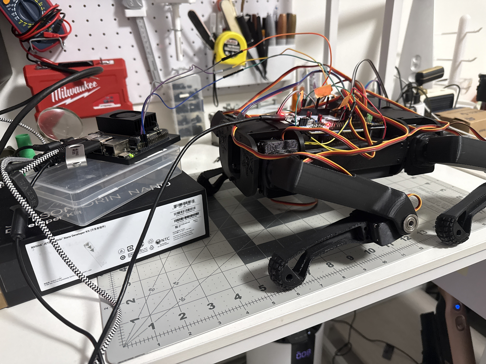
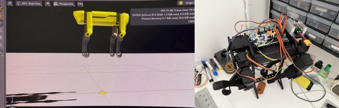
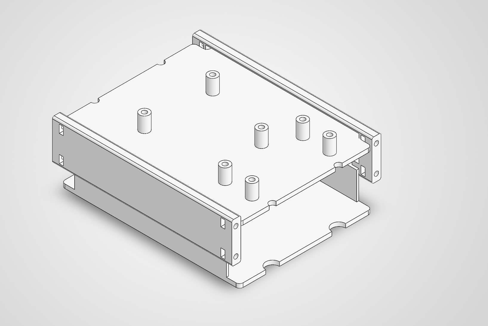
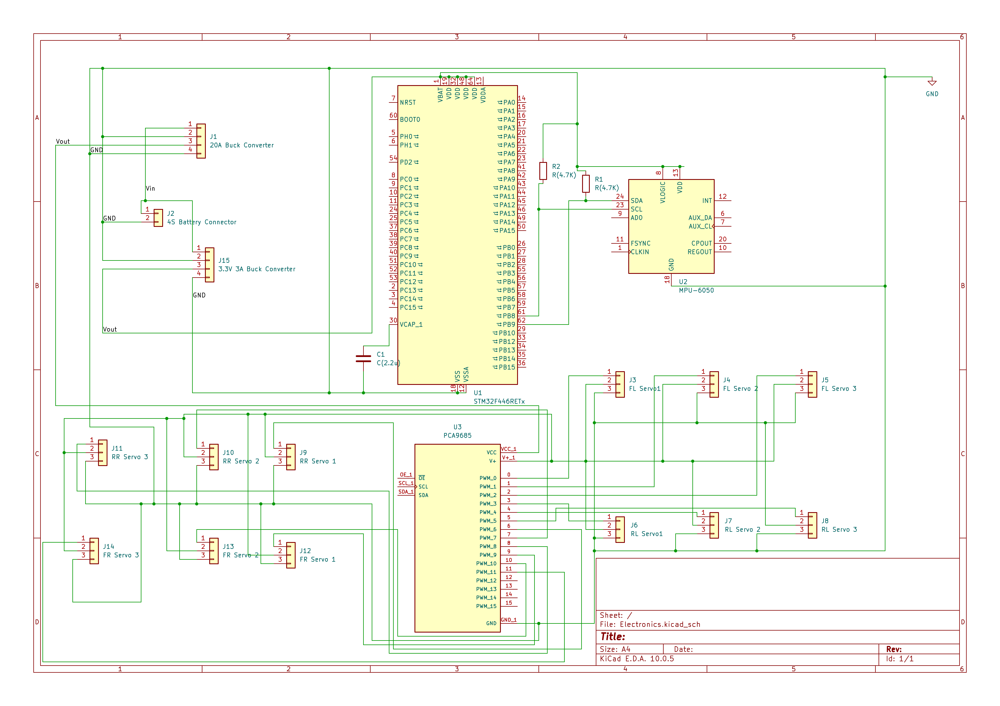
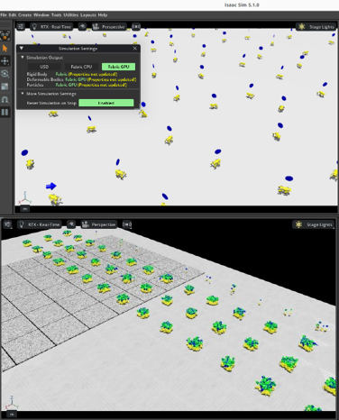

# Rex — Quadruped Locomotion in Isaac Lab

<div align="center">
    
\
**A high-fidelity reinforcement learning framework for SpotMicro-class quadruped locomotion**

[](https://isaac-sim.github.io/IsaacLab/)
[](https://www.python.org/)
[]()

</div>

---

## Overview

**Rex** is a custom work-in-progress manager-based RL task extension for [Isaac Lab](https://isaac-sim.github.io/IsaacLab/) that brings a servo-actuated SpotMicro-class quadruped (https://spotmicroai.readthedocs.io/en/latest/) into NVIDIA's GPU-accelerated simulation framework. Built on Isaac Lab's velocity-tracking locomotion pipeline, Rex enables large-scale parallel training of robust, terrain-adaptive gaits with full domain randomization.

The robot asset (`spot2.usd`) is customized after the open-source SpotMicro platform and driven by 12 MG996R servos.

<!-- TODO: Add side-by-side sim vs. real photo here -->
<div align="center">

\
*Left: Isaac Lab simulation | Right: Target hardware platform*

</div>

---

## Hardware & Electronics

### Custom CAD Model

<!-- TODO: Add CAD model renders/screenshots here -->
<div align="center">

\
*Custom CAD design of the SpotMicro-class chassis and leg assemblies*

</div>

### Electronics & Wiring

Wiring.md provides a detailed wiring pinout.
<!-- TODO: Add wiring diagram / electronics photo here -->
<div align="center">

\
*Wiring diagram: STM32 controller, MG996R servos, power distribution, and sensors*

</div>

---

## Environments

Six Gym-registered tasks cover the full training-to-deployment lifecycle:

| Task ID | Config Class | Description |
|---|---|---|
| `Isaac-Velocity-Flat-Rex-v0` | `RexFlatEnvCfg` | Velocity tracking on flat terrain with full domain randomization. Trains robust forward locomotion with randomized friction, mass, and external perturbations across 4096 parallel environments. |
| `Isaac-Velocity-Flat-Rex-Play-v0` | `RexFlatEnvCfg_PLAY` | Flat terrain evaluation variant with all domain randomization disabled. Use for policy validation, benchmarking, and sim-to-real transfer. Deterministic behavior for reproducible gait analysis. |
| `Isaac-Velocity-Rough-Rex-v0` | `RexRoughEnvCfg` | Velocity tracking on procedurally generated rough terrain with height-field noise, slope variation, and obstacle gaps. Domain randomization includes terrain geometry, friction, and push recovery. |
| `Isaac-Velocity-Rough-Rex-Play-v0` | `RexRoughEnvCfg_PLAY` | Rough terrain evaluation with fixed terrain seeds and no randomization. Validates generalization to unseen rough terrain layouts and measures robustness under consistent conditions. |
| `Isaac-Stand-Rex-v0` | `RexStandEnvCfg` | Static balancing task with zero velocity command. Trains postural stability with randomized CoM shifts, external pushes, and joint configuration noise. Foundation for standing recovery behaviors. |
| `Isaac-Stand-Rex-Play-v0` | `RexStandEnvCfg_PLAY` | Standing evaluation with deterministic conditions. Measures static stability margin, sway amplitude, and disturbance rejection without training noise. |

<!-- TODO: Add terrain comparison image -->
<div align="center">

\
*Flat (top) vs. procedurally generated rough terrain (bottom)*

</div>

---

## System Architecture

```
rex/
├── __init__.py                  # Gym environment registration (6 tasks)
├── rex_velocity_env_cfg.py      # Base LocomotionVelocityRoughEnvCfg
│                                 #   → scene, rewards, events, terrain
├── quad_ws_articulation.py      # QUAD_WS_CFG
│                                 #   → robot articulation + MG996R actuator model
├── flat_env_cfg.py              # Flat-terrain training & play configs
├── rough_env_cfg.py             # Rough-terrain training & play configs
├── stand_env_cfg.py             # Standing / balance task configs
└── agents/
    ├── rsl_rl_ppo_cfg.py        # RSL-RL PPO runner configurations
    ├── rl_games_flat_ppo_cfg.yaml
    ├── rl_games_rough_ppo_cfg.yaml
    ├── skrl_flat_ppo_cfg.yaml
    └── skrl_rough_ppo_cfg.yaml
```
## Multi-Framework RL Support

Rex ships with pre-tuned hyperparameters for three major Isaac Lab RL backends:

| Framework | Status | Notes |
|---|---|---|
| **RSL-RL** | ✅ Ready | On-policy PPO with recurrent state encoders |

---

## Quick Start

### Prerequisites

- [Isaac Sim](https://developer.nvidia.com/isaac-sim) ≥ 4.0
- [Isaac Lab](https://isaac-sim.github.io/IsaacLab/) ≥ 1.0
- Python 3.10+

### Installation

The RL training pipeline, reward shaping, and environment configuration were studied and implemented from the existing ANYmal locomotion training setup in Isaac Lab. The ANYmal reference provides the foundational velocity-tracking locomotion framework, domain randomization strategy, and curriculum design that Rex builds upon — adapted for a smaller servo-actuated quadruped platform. Place the package under:

```bash
source/isaaclab_tasks/isaaclab_tasks/manager_based/locomotion/velocity/config/rex/
```

Or register it as an external extension per the [official docs](https://isaac-sim.github.io/IsaacLab/).

> **⚠️ Asset Path:** Update the `usd_path` in `quad_ws_articulation.py` to point to your local `spot2.usd` before training.

### Training

**Flat terrain (RSL-RL):**
```bash
python scripts/rsl_rl/train.py --task Isaac-Velocity-Flat-Rex-v0 --headless
```

**Rough terrain (RSL-RL):**
```bash
python scripts/rsl_rl/train.py --task Isaac-Velocity-Rough-Rex-v0 --headless
```


<div align="center">


*Trained trotting gait on flat terrain*

</div>

---

## Results

Resulting videos are attached in docs folder

---

## Sim-to-Sim Validation

Before deploying on physical hardware, trained policies are validated through **sim-to-sim transfer** from Isaac Lab to PyBullet.

### Pipeline

1. **Train in Isaac Lab** — Export the trained policy checkpoint (`.pt`) after convergence on flat or rough terrain.
2. **Convert to ONNX** — Use Isaac Lab's export utility to convert the PyTorch policy to ONNX format for framework-agnostic inference.
3. **Load in PyBullet** — Instantiate a PyBullet simulation of the SpotMicro URDF with matching joint limits, mass properties, and actuator dynamics on the Jetson Orin Nano.
4. **Run inference** — Feed identical velocity commands and compare trajectories, foot contact patterns, and stability margins between Isaac Lab and PyBullet.

### Purpose

Sim-to-sim validation isolates **physics-engine discrepancies** from **sim-to-real gaps**. If the policy fails in PyBullet but works in Isaac Lab, the issue lies in physics parameterization (friction, contact stiffness, timestep) rather than the policy itself. This step ensures the policy is robust enough to survive the transition to a different simulator — a necessary precondition for sim-to-real deployment on the physical SpotMicro.

Sim-to-Sim videos are attached in docs folder

---

## License

*Pending*

---

## References

NVIDIA, "Isaac Sim," NVIDIA Developer, 2024. Accessed: Aug. 7, 2026. [Online]. Available: https://developer.nvidia.com/isaac-sim
NVIDIA, "Isaac Lab," NVIDIA Developer, 2024. Accessed: Aug. 7, 2026. [Online]. Available: https://developer.nvidia.com/isaac/lab
C. Schwarke et al., "RSL-RL: A Learning Library for Robotics Research," arXiv preprint arXiv:2509.10771, Sep. 2025. Accessed: Aug. 7, 2026. [Online]. Available: https://github.com/leggedrobotics/rsl_rl
SpotMicroAI, "SpotMicroAI Documentation," SpotMicroAI, 2026. Accessed: Aug. 7, 2026. [Online]. Available: https://spotmicroai.readthedocs.io/en/latest/
NVIDIA, "Isaac Lab — Locomotion Velocity Tracking," Isaac Lab Documentation. Accessed: Aug. 7, 2026. [Online]. Available: https://isaac-sim.github.io/IsaacLab/
robot mania, How to Train a Custom Quadruped Robot to Walk Using Isaac Lab. (Mar. 9, 2025). Accessed: Aug. 7, 2026. [Online Video]. Available: https://www.youtube.com/watch?v=z62oU4hM1xM
O. Omotuyi, D. Hoeller, and T. Burnham, "Closing the Sim-to-Real Gap: Training Spot Quadruped Locomotion with NVIDIA Isaac Lab," NVIDIA Technical Blog, Jun. 17, 2024. Accessed: Aug. 7, 2026. [Online]. Available: https://developer.nvidia.com/blog/closing-the-sim-to-real-gap-training-spot-quadruped-locomotion-with-nvidia-isaac-lab/
M. Kim, J.-S. Kim, and J.-H. Park, "Automated Hyperparameter Tuning in Reinforcement Learning for Quadrupedal Robot Locomotion," Electronics, vol. 13, no. 1, p. 116, 2023. https://doi.org/10.3390/electronics13010116.
